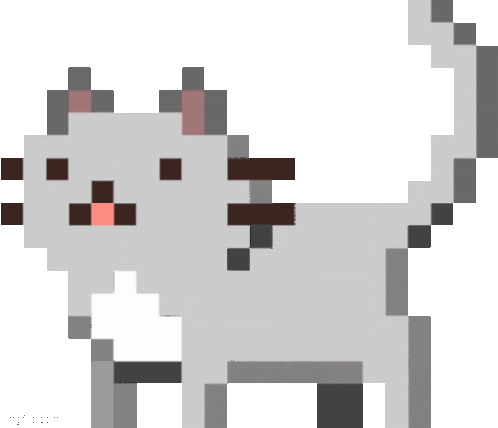

# Hi there!  I'm MOHAMED ELKADY 

 Welcome to my GitHub profile! 

I'm a passionate programmer from Egypt who loves to code and create innovative solutions. 

<a href="https://github.com/kady-x/kady-x/blob/main/README.md">English</a> |
<a href="https://github.com/kady-x/kady-x/blob/main/README_AR.md">عربي</a>

##  ABOUT ME

🔭 I’m currently working on **Alrehila, Drossna**, and **flutter_customs**.

🌱 I’m learning **Laravel, Python, C++, Java**, and **Data Structures**. Currently, I'm focused on building a web app with Laravel!

 I'm looking to collaborate on **Drossna**. If you're interested in working on specific features or technologies, let me know!

 Fun fact: I love coffee!  I can’t start my day without a cup of freshly brewed goodness! How about you? Do you have a favorite brew? 

##  LANGUAGES & TOOLS:

  

  

##  GITHUB STATS

<picture>
    <source media="(prefers-color-scheme: dark)" srcset="https://github.com/kady-x/kady-x/blob/main/snake/github-contribution-grid-snake-dark.svg">
    <source media="(prefers-color-scheme: light)" srcset="https://github.com/kady-x/kady-x/blob/main/snake/github-contribution-grid-snake.svg">
    
</picture>
  
##  Connect with Me

    
    
    
    
    
    

Thank you for visiting my profile! Feel free to check out my repositories! 

<i>❝<b>ɪɴ ᴛʜᴇ ʜᴜsᴛʟᴇ ᴀɴᴅ ʙᴜsᴛʟᴇ ᴏғ ᴛʜᴏᴜɢʜᴛs, ᴛʜᴇ sᴏᴜʟ ᴍᴀʏ ɢᴇᴛ ʟᴏsᴛ..</b>❞</i>
<i> ❝<b>ᴅᴀʀᴋɴᴇss ᴅᴏᴇs ɴᴏᴛ ᴇxᴛɪɴɢᴜɪsʜ ʟɪɢʜᴛ, ʙᴜᴛ ʀᴀᴛʜᴇʀ ᴇɴʜᴀɴᴄᴇs ɪᴛs ʙʀɪʟʟɪᴀɴᴄᴇ.</b>❞</i>
<i> ❝<b>ɴᴏᴛ ᴇᴠᴇʀʏᴏɴᴇ ᴡʜᴏ ᴡᴀʟᴋs ғᴏʀᴡᴀʀᴅ ᴋɴᴏᴡs ᴡʜᴇʀᴇ ᴛʜᴇʏ ᴡɪʟʟ ᴇɴᴅ ᴜᴘ. ✨🥷.</b>❞</i>
<i> ❝<b>ᴀ ʀɪᴠᴇʀ ᴄᴀɴɴᴏᴛ sᴛᴏᴘ ғʟᴏᴡɪɴɢ,🥷🎭 ɴᴏ ᴍᴀᴛᴛᴇʀ ᴡʜᴀᴛ ᴏʙsᴛᴀᴄʟᴇs ᴀʀᴇ ᴘʟᴀᴄᴇᴅ ɪɴ ɪᴛs ᴘᴀᴛʜ.✨</b>❞</i>

