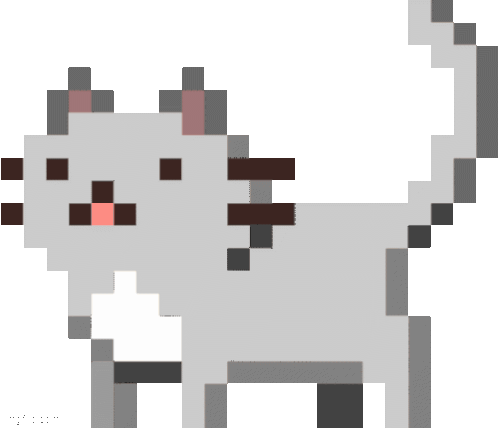

  

  
# مرحبًا!  أنا محمد القاضي 

 مرحبًا بك في ملفي الشخصي على GitHub! 

أنا مهندس برمجيات شغوف من مصر، أحب كتابة الأكواد البرمجية وبناء أنظمة وحلول مبتكرة. 

<a href="https://github.com/kady-x/kady-x/blob/main/README.md">English</a> |
<a href="https://github.com/kady-x/kady-x/blob/main/README_AR.md">عربي</a>

##  نبذة عني

🔭 أعمل حاليًا على **Drossna**، و **POS project**.

🌱 أتعلم وأتوسع في **Rust، Tauri**، **التزامن (Concurrency)** و **الخوارزميات**. حاليًا، أركز على بناء وتطوير تطبيقات الويب باستخدام Express و React!

 أبحث دائمًا عن التعاون في **Drossna**. إذا كنت مهتمًا بالعمل على ميزات أو تقنيات معينة، يسعدني تواصلك!

 معلومة ممتعة: أنا عاشق للقهوة!  لا أستطيع بدء يومي دون فنجان من القهوة الطازجة! ماذا عنك؟ هل لديك مشروب مفضل؟ 

  

##  اللغات والأدوات:

  

  

##  إحصائيات GitHub

##  اقتباس عشوائي للمطورين

<picture>
    <source media="(prefers-color-scheme: dark)" srcset="https://github.com/kady-x/kady-x/blob/main/snake/github-contribution-grid-snake-dark.svg">
    <source media="(prefers-color-scheme: light)" srcset="https://github.com/kady-x/kady-x/blob/main/snake/github-contribution-grid-snake.svg">
    
</picture>
  
##  تواصل معي

    
    
    
    

شكرًا لزيارتك ملفي الشخصي! لا تتردد في التحقق من مستودعاتي البرمجية! 

<i>❝<b>حاول تاني، اغلط تاني، اغلط أحسن.</b>❞</i>

